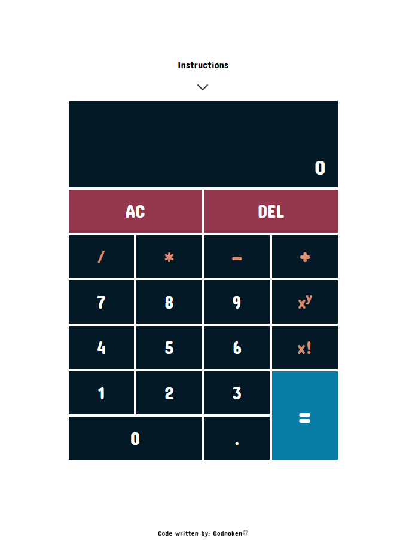

# Calculator
I've made this calculator based on the [The Odin Project](https://www.theodinproject.com/paths/foundations/courses/foundations/lessons/calculator) and it sets of rules, + some personal add-ons, changes and so on.

**Live link** https://godnoken.github.io/Calculator/

## What does this calculator have?
The basic arithmetics
Factorial
Power to/exponentiation (with negative exponents too!)
Decimal
Negative numbers
-- becomes +
Clear and undo buttons
Instructions (keyboard support!)

## What I've learned
Do not write hundreds of lines of code without making sure to giving yourself a hand and making comments for some of it.. Also.. maybe refactor sooner. Biggest takeaway by far is to plan more. Do not start a project without first creating a README and go through some pseudocode. It will help, don't forget that.

Pure coding wise:

DOM manipulation
Animations
Making if statements shorter/more readable
Taking concept to coding, i.e. math

## Languages used

HTML, CSS and JavaScript